# UML Diagrams — EM SME System

> **Rendering:** Open in VS Code with the *Markdown Preview Mermaid Support* extension,  
> or paste any diagram block at [mermaid.live](https://mermaid.live).

---

## 1 · Entity Relationship Diagrams

> The full schema has 14 tables. To keep each diagram readable, the ERD is split into
> three domain groups. Only key columns are shown; timestamps (`created_at`, `updated_at`) are omitted for brevity.

---

### 1A · Identity & Access Domain

_Covers: Organisations, Users, Refresh Tokens, Invitations_

---

### 1B · Task & Event Domain

_Covers: Tasks, Task Assignments, Task Comments, Events, Categories_

---

### 1C · Financial Domain

_Covers: Bank Accounts, Transactions, Contractors, Payments, Task-Payment Links_

---

## 2 · Use Case Diagram

> Shows which **actor** can perform which **actions** in the system.

```mermaid
graph LR
    %% ── Actors ──────────────────────────────────────────
    OW(["👤 Owner"])
    MG(["👤 Manager"])
    EM(["👤 Employee"])
    CO(["👤 Contractor"])
    SY(["⚙️ System"])

    %% ── Use Cases ───────────────────────────────────────
    subgraph Auth ["🔐 Authentication"]
        direction TB
        A1["Register & Create Org"]
        A2["Login / Logout"]
        A3["Refresh Token"]
        A4["Reset Password"]
    end

    subgraph Team ["👥 Team Management"]
        direction TB
        T1["Invite Member (email)"]
        T2["Accept Invitation"]
        T3["View Team Directory"]
        T4["Assign / Change Role"]
    end

    subgraph Tasks ["✅ Task Management"]
        direction TB
        K1["Create / Edit Task"]
        K2["Assign Task to User"]
        K3["Update Task Status"]
        K4["Add Comment / Subtask"]
    end

    subgraph Finance ["💰 Financial Management"]
        direction TB
        F1["Upload Bank Statement"]
        F2["View & Filter Transactions"]
        F3["Reconcile Transaction"]
        F4["Manage Contractors"]
        F5["Create / Track Payment"]
    end

    subgraph Events ["📅 Event Management"]
        direction TB
        E1["Create Event / Project"]
        E2["Link Transactions to Event"]
        E3["Track Event Budget"]
    end

    subgraph AI ["🤖 AI & Analytics"]
        direction TB
        I1["Ask AI Business Assistant"]
        I2["View Analytics Dashboard"]
    end

    subgraph Files ["📁 File & Meetings"]
        direction TB
        L1["Upload / View Files"]
        L2["Schedule Meeting"]
    end

    %% ── Owner connections ────────────────────────────────
    OW --> A1 & A2 & T1 & T4
    OW --> F1 & F3 & F4 & F5
    OW --> E1 & E2 & E3
    OW --> I1 & I2

    %% ── Manager connections ──────────────────────────────
    MG --> A2 & T1 & K1 & K2
    MG --> F1 & F4 & F5
    MG --> E1 & I2 & L2

    %% ── Employee connections ─────────────────────────────
    EM --> A2 & A4 & T2 & T3
    EM --> K3 & K4 & L1 & L2

    %% ── Contractor connections ───────────────────────────
    CO --> A2 & T2 & K3

    %% ── System connections ───────────────────────────────
    SY --> A3 & I2
```

---

## 3 · Class Diagram

> Shows **key attributes and relationships** between the main domain classes.  
> Methods shown are the most behaviourally important ones only.

---

## 4 · Sequence Diagrams

---

### 4A · User Registration

```mermaid
sequenceDiagram
    autonumber
    actor U as Client (Browser)
    participant API as FastAPI Backend
    participant DB  as PostgreSQL
    participant EM  as Resend (Email)

    U   ->> API : POST /auth/register<br/>{email, password, full_name, org_name}
    API ->> API : Validate input (Pydantic)
    API ->> DB  : Check — email already exists?
    DB  -->> API: Not found ✓

    API ->> DB  : INSERT organizations
    DB  -->> API: organization_id

    API ->> API : hash_password (bcrypt, cost=12)
    API ->> DB  : INSERT users (role = owner)
    DB  -->> API: user_id

    API ->> DB  : INSERT refresh_token
    API ->> EM  : Send welcome email (optional)
    EM  -->> U  : Welcome email

    API -->> U  : 201 {access_token, refresh_token, user}
```

---

### 4B · Team Invitation Flow

```mermaid
sequenceDiagram
    autonumber
    actor OW  as Owner / Manager
    participant API  as FastAPI Backend
    participant DB   as PostgreSQL
    participant MAIL as Resend (Email)
    actor INV as Invitee

    OW   ->> API  : POST /invitations {email, role}
    API  ->> DB   : Check — pending invite exists?
    DB   -->> API : None found ✓
    API  ->> DB   : INSERT invitations (token, expires_in=7d)
    API  ->> MAIL : Send invite link (token in URL)
    MAIL -->> INV : "You've been invited" email

    INV  ->> API  : GET /invitations/validate?token=…
    API  ->> DB   : Fetch invitation
    DB   -->> API : Valid & not expired ✓
    API  -->> INV : {org_name, role, email}

    INV  ->> API  : POST /invitations/accept {token, full_name, password}
    API  ->> DB   : INSERT users (linked to org, role from invite)
    API  ->> DB   : UPDATE invitations SET status=accepted
    API  -->> INV : 201 {access_token, user}
```

---

### 4C · Bank Statement Upload

---

## 5 · Component Diagram

> High-level view of how frontend, backend, and external services connect.

```mermaid
graph TB
    subgraph FE ["🖥️  Frontend — React + TypeScript  (Vercel)"]
        direction LR
        P1["Login / Register"]
        P2["Dashboard"]
        P3["Tasks Board"]
        P4["Finance Module"]
        P5["Team & Invites"]
        P6["Events"]
        P7["AI Assistant"]
        P8["Files / Meetings"]
        AX["Axios API Client"]
    end

    subgraph BE ["⚙️  Backend — FastAPI (Docker · Render)"]
        direction TB
        R1["/auth"]
        R2["/users"]
        R3["/tasks"]
        R4["/financial"]
        R5["/invitations"]
        R6["/events"]
        R7["/ai"]
        R8["/analytics"]
        SVC["Services Layer"]
        AI["LangGraph AI Agent"]
    end

    subgraph INFRA ["☁️  Infrastructure"]
        PG[("PostgreSQL")]
        RD[("Redis")]
        QD[("Qdrant\nVector DB")]
        RS["Resend\nEmail API"]
        LLM["OpenAI / Gemini\nLLM APIs"]
    end

    AX  <-->|"HTTPS REST"| R1
    AX  <-->|"HTTPS REST"| R2
    AX  <-->|"HTTPS REST"| R3
    AX  <-->|"HTTPS REST"| R4
    AX  <-->|"HTTPS REST"| R5
    AX  <-->|"HTTPS REST"| R6
    AX  <-->|"HTTPS REST"| R7
    AX  <-->|"HTTPS REST"| R8

    R1 & R2 & R3 & R4 & R5 & R6 --> SVC
    R7 --> AI
    SVC --> PG
    SVC --> RD
    SVC --> RS
    AI  --> QD
    AI  --> LLM
```

---

## 6 · Deployment Diagram

> Shows where each part of the system runs in production.

---

## 7 · Context Diagram (Level-0 DFD)

> Shows the **entire system as a single process** ("black box") and all external entities
> that interact with it — the highest-level view of the system boundary.

```mermaid
graph TD
    %% ── External Entities ────────────────────────────────────
    OWNER(["👤 Owner / Admin"])
    MANAGER(["👤 Manager"])
    EMPLOYEE(["👤 Employee"])
    CONTRACTOR_EXT(["👤 Contractor"])
    EMAIL_SVC(["📧 Resend\nEmail Service"])
    LLM_SVC(["🤖 OpenAI / Gemini\nLLM APIs"])
    BANK(["🏦 Bank Statement\nCSV / XLSX File"])

    %% ── System boundary ──────────────────────────────────────
    SYS[["⬛  EM SME SYSTEM\n\nEvent Management SaaS\nfor Small & Medium Enterprises"]]

    %% ── Flows INTO the system ────────────────────────────────
    OWNER      -->|"Register org, manage settings,\nupload statements, view reports"| SYS
    MANAGER    -->|"Invite members, assign tasks,\nmanage contractors & payments"| SYS
    EMPLOYEE   -->|"Accept invite, update tasks,\nupload files, join meetings"| SYS
    CONTRACTOR_EXT -->|"Accept invite, view\nassigned tasks"| SYS
    BANK       -->|"Bank statement file\nCSV / XLSX"| SYS

    %% ── Flows OUT of the system ──────────────────────────────
    SYS -->|"Invitation emails,\nwelcome emails"| EMAIL_SVC
    SYS -->|"Business Q&A prompts\n+ financial context"| LLM_SVC
    SYS -->|"Dashboard, reports,\ntask updates, alerts"| OWNER
    SYS -->|"Task boards, financial\nsummaries, team directory"| MANAGER
    SYS -->|"Task assignments,\nnotifications"| EMPLOYEE
    SYS -->|"AI-generated\nbusiness insights"| OWNER
    LLM_SVC -->|"Natural language\nanswers"| SYS
    EMAIL_SVC -->|"Delivery confirmation"| SYS
```

---

## 8 · Data Flow Diagram (Level-1)

> Expands the system black box into **six internal processes**, showing how data moves
> between actors, processes, and the five data stores.

```mermaid
graph TD
    %% ── External entities ────────────────────────────────────
    USER(["👤 User\nOwner / Manager / Employee"])
    BANK_FILE(["📄 Bank Statement\nCSV / XLSX"])
    EMAIL_SVC(["📧 Resend\nEmail Service"])
    LLM(["🤖 LLM APIs\nOpenAI / Gemini"])

    %% ── Level-1 Processes ────────────────────────────────────
    P1["1.0\n🔐 Authentication\n& User Management"]
    P2["2.0\n✅ Task\nManagement"]
    P3["3.0\n💰 Financial\nProcessing"]
    P4["4.0\n✉️ Invitation\n& Onboarding"]
    P5["5.0\n🤖 AI Business\nIntelligence"]
    P6["6.0\n📅 Event &\nCategory Mgmt"]

    %% ── Data Stores ──────────────────────────────────────────
    DS1[("D1 · Users &\nOrganizations DB")]
    DS2[("D2 · Tasks &\nAssignments DB")]
    DS3[("D3 · Transactions,\nPayments & Contractors DB")]
    DS4[("D4 · Invitations DB")]
    DS5[("D5 · Events &\nCategories DB")]

    %% ── Flows ────────────────────────────────────────────────
    USER      -->|"Login / Registration data"| P1
    P1        -->|"JWT access + refresh tokens"| USER
    P1        <-->|"Read / Write user & org records"| DS1

    USER      -->|"Create / Update / Assign task"| P2
    P2        -->|"Task status, comments, board view"| USER
    P2        <-->|"Read / Write tasks & assignments"| DS2
    DS1       -->|"Resolve user & org context"| P2

    BANK_FILE -->|"Raw CSV / XLSX rows"| P3
    USER      -->|"Reconcile / pay contractor"| P3
    P3        -->|"Parsed transactions, reports"| USER
    P3        <-->|"Read / Write financial records"| DS3
    DS1       -->|"Org tenant scope"| P3

    USER      -->|"Send invite (email + role)"| P4
    P4        -->|"Invite confirmation & accept form"| USER
    P4        -->|"Invite email with token"| EMAIL_SVC
    EMAIL_SVC -->|"Delivery status"| P4
    P4        <-->|"Read / Write invitation records"| DS4
    P4        -->|"Create new user on accept"| DS1

    USER      -->|"Natural language business question"| P5
    P5        -->|"NL insights & analytics"| USER
    P5        -->|"Prompt + org context"| LLM
    LLM       -->|"Generated answer"| P5
    DS3       -->|"Financial data for context"| P5
    DS2       -->|"Task data for context"| P5

    USER      -->|"Create / edit event or category"| P6
    P6        -->|"Event list, budget tracking view"| USER
    P6        <-->|"Read / Write event & category records"| DS5
    DS3       -->|"Link transactions to events"| P6
```

